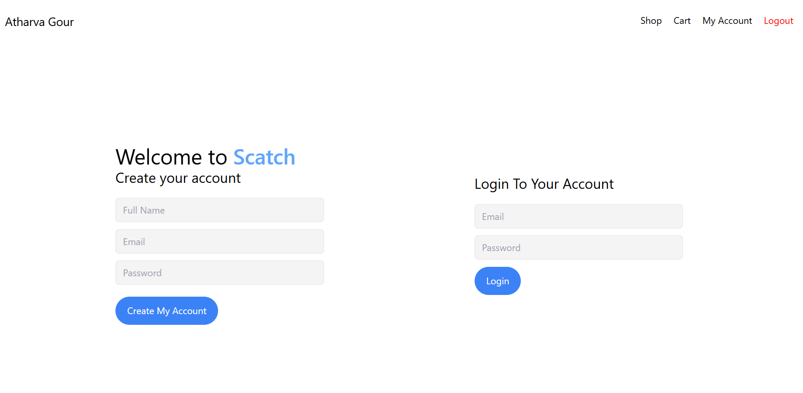
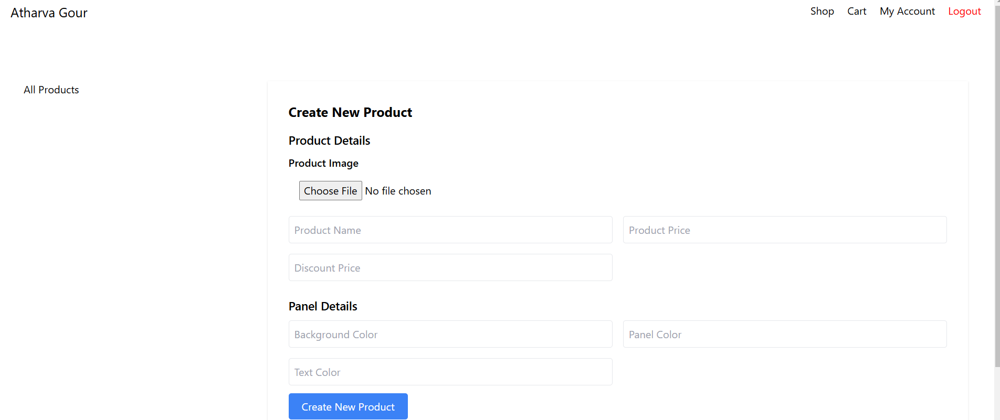
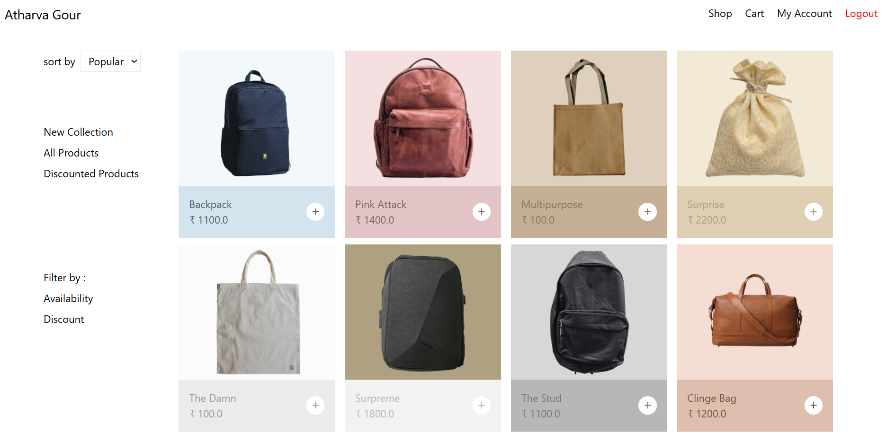

# Luxury Bag Website

A premium luxury bag website built with Spring Boot 3 and Spring Security 6.

## Features

1. **Login and Register Page**  
   Accessible at `localhost:8081/`  
     

2. **Password Encryption**  
   User passwords are stored securely in the database using BCrypt encryption.  

3. **Authentication**  
   Spring Security 6 is used to handle authentication and user authorization.  

4. **Create Product Feature**  
   Admins can create products at `localhost:8081/product/create`.  
     

5. **Shop Feature**  
   A shopping page where all products are listed at `localhost:8081/shop`.  
     

6. **Cart Feature**  
   Users can view and manage their cart at `localhost:8081/cart`.  
   

7. **MongoDB Integration**  
   The application is connected to a MongoDB database to store user, product, and order information.

8. **Logout Feature**    
   Users can log out of the system. Once logged out, they are redirected to the login page.

---

## Planned Features

- **Filter Products**: Ability to filter products by popularity, newest, etc.
- **Account Details**: User account management and profile details.
- **Payment Gateway**: Integration with a payment gateway for transactions.
- **OAuth2 Login**: GitHub and Google OAuth2 login functionality for easier authentication.

---

### Prerequisites:
- **Java 21** used here
- **Spring Boot 3.x** setup
- **MongoDB** running locally or a MongoDB Atlas cluster
- **Node.js** and **npm** (for front-end dependencies)

### Steps:
1. **Clone the repository**:  
   ```bash
   git clone https://github.com/athrocks/Luxury-Bag-website.git
   cd Luxury-Bag-website
   ```
2. **Set up MongoDB**:  
   Make sure MongoDB is running locally or configure your MongoDB Atlas connection.  
   Update application.properties with the correct MongoDB connection URI.  
3. **Build and Run the Spring Boot application**:
   ```bash
   ./mvnw spring-boot:run
   ```
4. Install front-end dependencies (If applicable): Navigate to the front-end folder where package.json is located (if you're using npm for front-end management):  

   ```bash
   npm install
   npm run start
   ```
5. **Access the application**:  
   Open a browser and go to http://localhost:8081/ to access the website.

6. **Log in or register**:   
Register a new account or log in with an existing one to start using the features.

